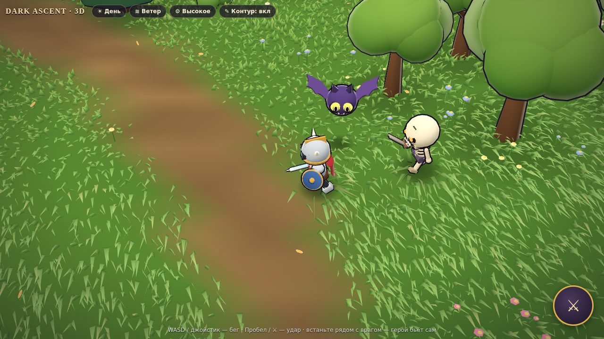
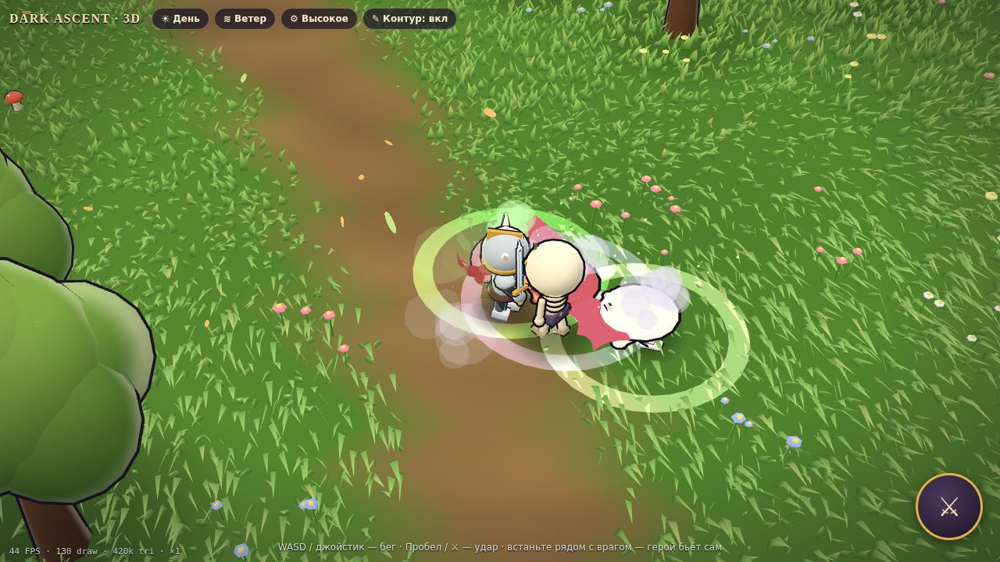
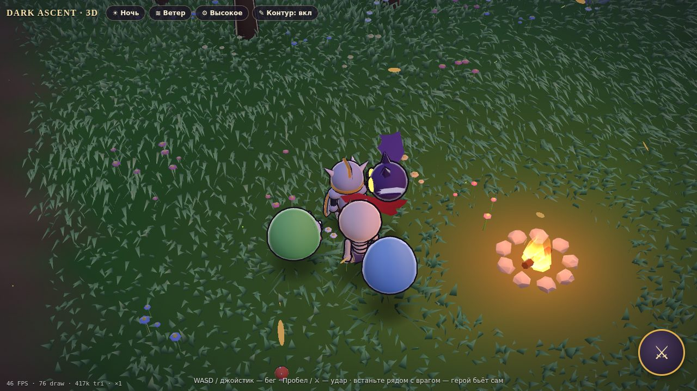
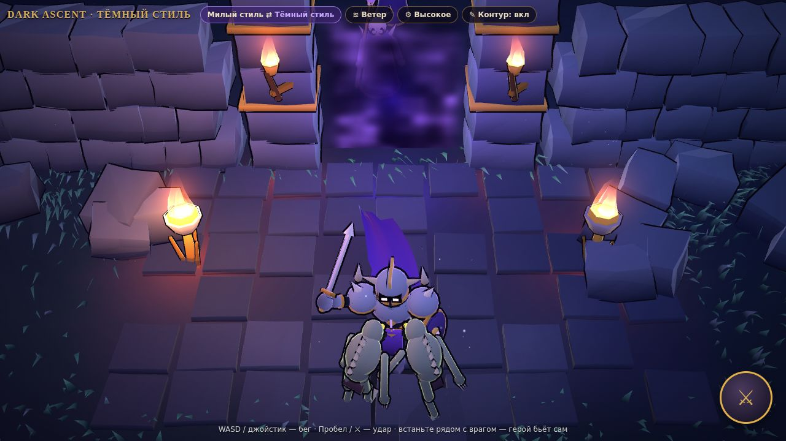
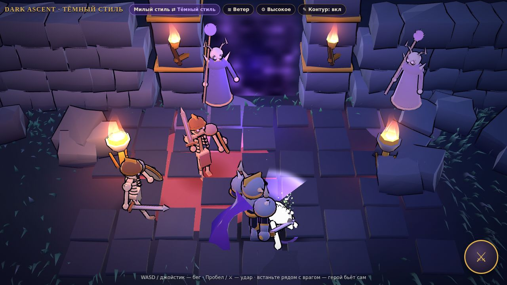
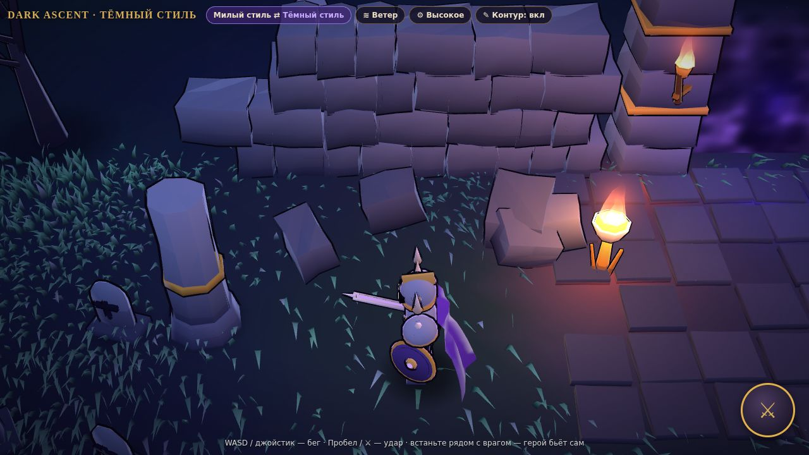
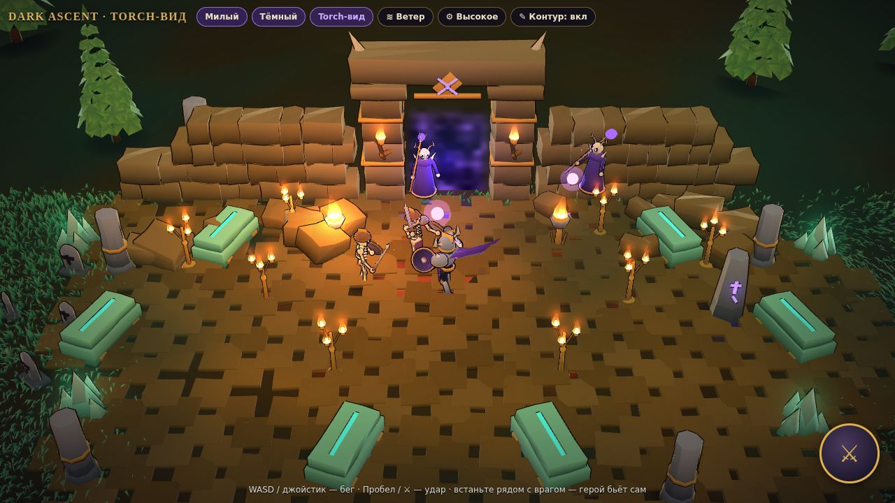
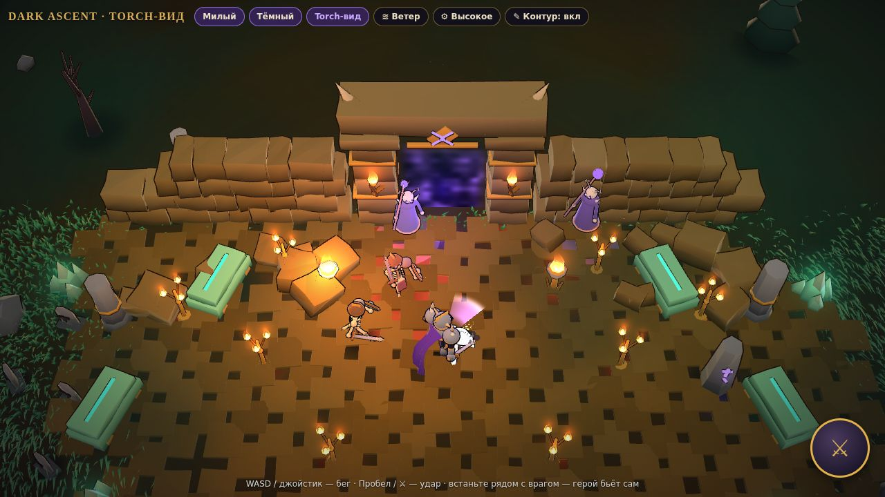
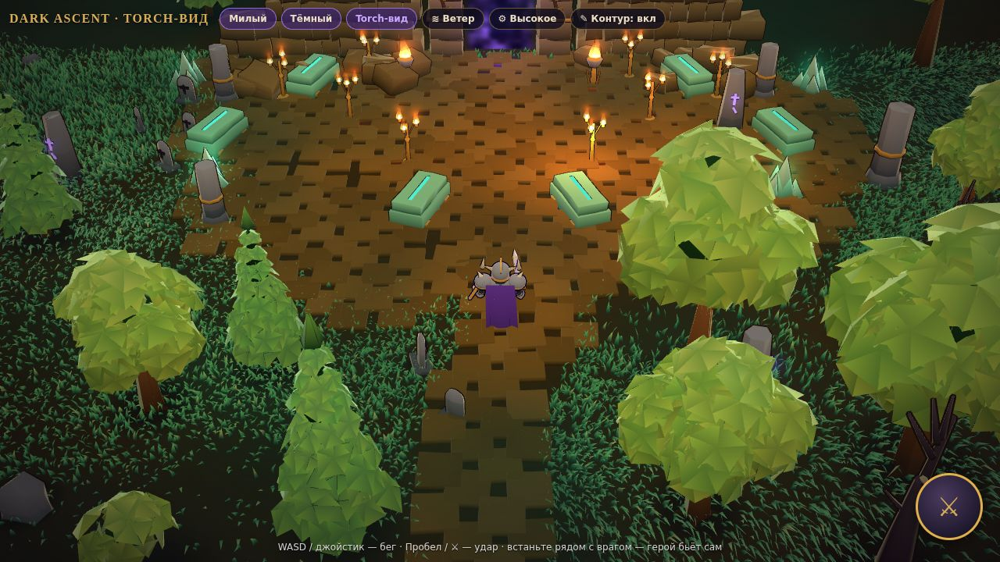

# Dark Ascent · Three.js — прототип стилизованной 3D-графики

Отдельная демо-сцена, чтобы проверить, как Dark Ascent выглядит в «живом» 3D: трава и деревья качаются на ветру, плащ героя развевается, мобы милые, но жутковатые. Всё процедурное и бесплатное (three.js, MIT), без внешних ассетов и CDN, поэтому годится для Яндекс Игр.





## Запуск
```
cd lab/three
python3 -m http.server 8000
```
Откройте http://localhost:8000. Параметры адреса: `?t=dusk` включает ночь, `?q=low|med|high` задаёт качество.

Управление: WASD/стрелки или джойстик (касание левой половины экрана), Пробел или ⚔ — удар. Если стоять рядом с врагом, герой бьёт сам, как в Archero. Кнопки сверху: День/Ночь, сила ветра (Штиль/Ветер/Буря), качество, контуры.

## Что внутри
| Файл | Что делает |
|---|---|
| `js/toon.js` | toon-материал (мягкий 3-ступенчатый ramp, rim-свет, самосвечение через альфу цвета вершины, вспышка при ударе), ветер в вершинном шейдере, растворение дизерингом между камерой и героем, контур inverted hull |
| `js/geo.js` | процедурная геометрия: покраска с градиентом, слияние мешей, «сферизация» нормалей для крон, шум |
| `js/world.js` | земля, трава (до 80 тыс. травинок, волны порывов, примятие под персонажами), 2 вида деревьев, кусты, камни, цветы, грибы, могилы, рунный камень, костёр со светом, листопад, светлячки |
| `js/hero.js` | чиби-рыцарь с процедурной анимацией (бег, дыхание, 2 удара комбо) и плащом на Verlet-физике (ветер, инерция, столкновение с телом) |
| `js/mobs.js` | скелет, слизень (3 цвета), летучая мышь: ИИ (бродит, преследует, замах с красной подсветкой, выпад), сквош-анимация, отбрасывание, смерть, возрождение |
| `js/fx.js` | дуга удара, искры, клубы, кольца |
| `js/main.js` | рендерер, пресеты освещения, камера, хит-стоп и тряска, адаптивное качество |

## Бюджет
- Загрузка ≈ 200 КБ gzip (three.js 170 КБ + код 26 КБ), ноль картинок.
- Высокое качество: ≈ 50–100 draw calls, ≈ 400 тыс. треугольников (из них 290 тыс. трава). Среднее: трава ×0.55, pixel ratio ≤ 1.5. Низкое: трава ×0.28, pixel ratio 1, без контуров и динамического света.
- FPS проверялся только в программном рендере (SwiftShader в headless Chromium без GPU): там 40+ FPS при 1280×720. Перед релизом нужен прогон на реальных слабых Android-телефонах.

## Как перенести в игру
Мировые координаты игры — метры на плоскости (x, y). В three.js это (x, 0, y) по осям X и Z, так что логика (`js/game/*`) переносится без изменений. Меняется только слой отрисовки:
1. **Этап 1 — деревня и открытые локации.** Новый `js/render/renderer3d.js`: берёт сущности из `ctx` и ставит их меши в сцену. Камера с yaw 45°, как сейчас (константа `CAM_YAW`). DOM-интерфейс (HUD, окна) остаётся без изменений.
2. **Этап 2 — катакомбы.** Стены и пол — instanced-блоки из `zone.json`. Прозрачность стен у героя уже есть (`fade` в `toon.js`). Факелы — самосвечение, не лампы.
3. **Этап 3 — классы и снаряжение.** Оружие и шлемы — отдельные меши на «костях» героя, их можно менять (`hero.sword`, `hero.shield`).
4. В сборку для Яндекса папка `lab/` не входит. Когда 3D войдёт в игру, `vendor/three.module.min.js` переедет в `js/vendor/`.

## Тёмный стиль (`dark.html`)
Вторая демо-страница с тем же движком: «кость, латунь и бездна», герой 1:4, нежить Палача Бездны. Между стилями переключает кнопка «Милый стиль ⇄ Тёмный стиль» вверху обеих страниц.





| Файл | Что делает |
|---|---|
| `js/dark/world.js` | ночь у входа в катакомбы: арка и стены из рубленых блоков (инстансинг, 6 геометрий), 4 факела, Бездна за аркой (шейдер), туман в три слоя, мёртвые деревья и ёлки на ветру, трава, могилы, рунные камни, искры и огоньки |
| `js/dark/hero.js` | рогатый рыцарь в пропорциях 1:4 (голова 0,5 м из 2,0 м), наплечники, светящийся визор, плащ на том же Verlet (`Cape` с параметрами) |
| `js/dark/mobs.js` | скелет-воин, упырь, костяной колдун (снаряд Бездны); телеграф атаки (пятно на земле и пульс), вспышка при ударе, смерть, возрождение из портала |
| `js/dark/main.js` | свет (луна + один тёплый свет, который переходит к ближайшему факелу + один фиолетовый у арки), камера с героем в нижней трети, бой, хит-стоп, тряска |

Параметры адреса: `?q=low|med|high`, `?mobs=0` (без мобов). Бюджет: ≈ 96 draw calls и ≈ 135 тыс. треугольников на высоком качестве (в первом прототипе ≈ 425 тыс.), без текстур. В общем коде расширены только `Cape` (параметры, экспорт) и `world.js` (экспорт шейдера травы), первый прототип работает как раньше.

### Torch-вид (`torch.html`)
Тот же код, но с `window.LOOK = "torch"`: тёплый булыжный склеп со свечами, бирюзовыми саркофагами и кристаллами. Камера низкая и наклонена вперёд (pitch ≈ 37°, дистанция 30), герой стоит выше центра кадра, снизу остаётся запас обзора.




### Анимация и деревья (torch-вид)
- `js/dark/rig.js`: двухсегментный IK ног (колени гнутся в нужную сторону, стопа остаётся на земле), цикл шага с фазой от скорости (стопы не скользят), позы стопы (пятка, носок).
- Герой: таз качается и скручивается, торс противовращается, наклон вперёд от скорости и в поворотах, руки с локтями. Удар из трёх фаз: широкий замах над головой, выпад с приседанием и разведёнными ногами, проводка. Щит страхует.
- Скелет и упырь: те же колени и локти, замах всем корпусом.
- Деревья: крона из слоёв гранёных листовых пластин (пятиугольники с приподнятым центром, у каждой своя грань света), ветви ведут в доли кроны; ёлки из ярусов тех же пластин; три вида лиственных (два размера и деревце). Бег: длинный шаг, ритм ≈ 1.9 цикла/с, стопа не скользит.
- Бюджет: ≈ 220 draw calls и ≈ 340 тыс. треугольников. Основную часть draw calls дают раздельные части тела героя (28) и мобов (≈ 126 вместе) вместе с контурами. При переносе в игру персонажей стоит собрать в SkinnedMesh (1 вызов на персонажа), это вернёт бюджет к ≈ 100.


